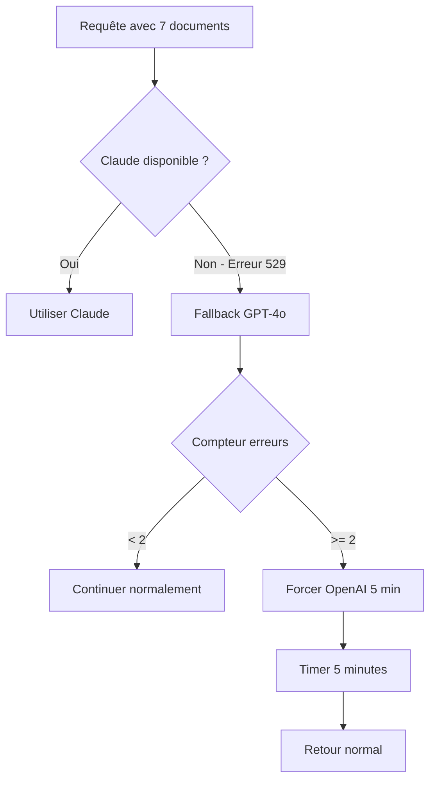

# Gestion de la Surcharge Claude (Erreur 529)

## 🚨 Problème : API Claude Surchargée

L'erreur **529 "Overloaded"** signifie que l'API Claude est temporairement surchargée. C'est un problème fréquent lors des pics d'utilisation.

## ✅ Solutions Implémentées

### 1. Fallback Immédiat vers GPT-4o

En cas d'erreur 529, le système bascule immédiatement vers GPT-4o :

```
[Hybrid] Claude overloaded (529), immediate fallback to OpenAI
```

**Avantage** : L'utilisateur ne voit aucune interruption de service.

### 2. Protection Anti-Surcharge

Après **2 erreurs 529 consécutives**, le système :
- Force l'utilisation d'OpenAI pendant **5 minutes**
- Évite de solliciter Claude inutilement
- Réinitialise automatiquement après expiration

```
[Hybrid] Too many Claude overloads, forcing OpenAI for 300 seconds
```

### 3. Logs Détaillés

Les logs indiquent clairement :
- Quand Claude est surchargé
- Le compteur d'erreurs
- Quand le fallback forcé est activé/désactivé

## 📊 Flux de Gestion



## 🔍 Monitoring

### Logs à Surveiller

1. **Première erreur 529** :
   ```
   Claude streaming error: Error: 529
   [Hybrid] Claude overload count: 1/2
   ```

2. **Activation du fallback forcé** :
   ```
   [Hybrid] Claude overload count: 2/2
   [Hybrid] Too many Claude overloads, forcing OpenAI for 300 seconds
   ```

3. **Retour à la normale** :
   ```
   [Hybrid] Force OpenAI fallback expired, returning to normal operation
   ```

## 🛡️ Garanties pour l'Utilisateur

1. **Aucune interruption** : Basculement transparent
2. **Qualité maintenue** : GPT-4o offre une qualité similaire
3. **Auto-réparation** : Retour automatique après 5 minutes
4. **Logs complets** : Traçabilité totale

## 💡 Actions Recommandées

### Si les Erreurs 529 Persistent

1. **Vérifier le statut Anthropic** : https://status.anthropic.com/
2. **Augmenter le délai** : Modifier `FALLBACK_DURATION` si nécessaire
3. **Ajuster le seuil** : Modifier `OVERLOAD_THRESHOLD` selon les besoins

### Configuration Actuelle

```typescript
const OVERLOAD_THRESHOLD = 2;        // Erreurs avant fallback forcé
const FALLBACK_DURATION = 5 * 60 * 1000; // 5 minutes
```

## ✅ Résumé

Le système est maintenant **résilient** aux surcharges de Claude :
- **Fallback automatique** vers GPT-4o
- **Protection intelligente** contre les tentatives répétées
- **Transparence totale** pour l'utilisateur
- **Auto-réparation** après 5 minutes

L'utilisateur ne verra **aucune différence** même si Claude est indisponible ! 🚀 