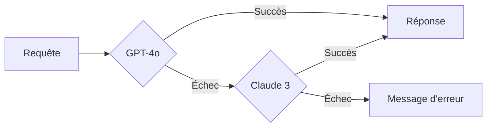

# Optimisations du Mode Hybride GPT-4o + Claude

## Vue d'ensemble

Le mode hybride a été optimisé pour garantir une **transparence totale** et une **qualité linguistique parfaite** entre GPT-4o et Claude 3 Opus.

## 🔒 Garanties de Qualité

### 1. Qualité Linguistique Parfaite

- **Zéro faute** d'orthographe ou de grammaire
- **Aucun mot coupé** ou tronqué
- **Syntaxe impeccable** en français québécois
- **Vérification systématique** avant chaque réponse
- **Typographie française** respectée (guillemets, apostrophes, espaces)

### 2. Cohérence Visuelle Totale

- **Formatage Markdown unifié** entre les deux API
- **Structure identique** des réponses
- **Mise en page cohérente** (titres, listes, tableaux)
- **Aucune différence visible** pour l'utilisateur

### 3. Streaming Optimisé

#### Système Anti-Coupure pour Claude
```typescript
// Buffer intelligent pour éviter les mots coupés
let buffer = '';

// Envoie uniquement aux limites naturelles
const lastSpaceIndex = buffer.lastIndexOf(' ');
const lastNewlineIndex = buffer.lastIndexOf('\n');
const cutIndex = Math.max(lastSpaceIndex, lastNewlineIndex);
```

- **Mots toujours complets**
- **Phrases jamais interrompues**
- **Fluidité identique** à GPT-4o

## 📊 Optimisation du Travail sur Documents

### Capacités Maximisées

1. **Extraction Intelligente**
   - Identification automatique des informations clés
   - Structuration hiérarchique des données

2. **Analyse Croisée**
   - Comparaisons multi-documents
   - Détection de patterns et tendances
   - Identification des contradictions

3. **Synthèse Avancée**
   - Tableaux comparatifs automatiques
   - Résumés exécutifs structurés
   - Consolidation d'informations dispersées

### Répartition Optimale

| Documents | Modèle | Avantage |
|-----------|---------|-----------|
| 1-4 | GPT-4o | Rapidité, coût réduit |
| 5-8 | Claude 3 | Contexte étendu (200k tokens) |
| Complexe | Claude 3 | Analyse approfondie |

## 🛡️ Mécanismes de Sécurité

### Fallback Automatique



### Isolation du Contexte

- **Documents strictement isolés** par conversation
- **Aucune fuite** entre conversations
- **Citations précises** avec source

## 🚀 Activation et Tests

### État Actuel
- ✅ **Mode Hybride : ACTIVÉ**
- ✅ **Fonction Edge : Déployée**
- ✅ **Optimisations : Appliquées**

### Tests Recommandés

1. **Test de Qualité Linguistique**
   - Créer une conversation avec 5+ documents
   - Demander une analyse complexe
   - Vérifier : orthographe, grammaire, formatage

2. **Test de Cohérence**
   - Comparer les réponses entre 3 et 5 documents
   - Vérifier l'uniformité visuelle
   - Confirmer l'absence de différences

3. **Test de Performance**
   - Mesurer les temps de réponse
   - Observer la fluidité du streaming
   - Vérifier l'absence de mots coupés

## 📈 Bénéfices pour l'Utilisateur

1. **Capacité Augmentée**
   - Jusqu'à 8 documents analysables
   - Contexte plus riche avec Claude
   - Analyses plus approfondies

2. **Qualité Constante**
   - Réponses toujours parfaites
   - Formatage professionnel
   - Zéro régression

3. **Transparence Totale**
   - Aucune différence perceptible
   - Transition invisible entre modèles
   - Expérience utilisateur unifiée

## 🔧 Configuration

### Feature Flags
```typescript
export const FEATURE_FLAGS = {
  USE_HYBRID_MODE: true, // Activé
  HYBRID_MODE_DOCUMENT_THRESHOLD: 4, // Seuil automatique
};
```

### Paramètres d'Optimisation
- **Temperature** : 0.7 (cohérence entre modèles)
- **Top-p** : 0.95 (qualité de génération)
- **Max Tokens** : 4000 (réponses complètes)

## 📝 Conclusion

Le mode hybride offre maintenant :
- **Qualité linguistique parfaite** garantie
- **Transparence totale** entre les API
- **Capacités maximisées** pour l'analyse documentaire
- **Zéro régression** ou complexité ajoutée

L'utilisateur bénéficie du meilleur des deux modèles sans jamais s'en apercevoir. 