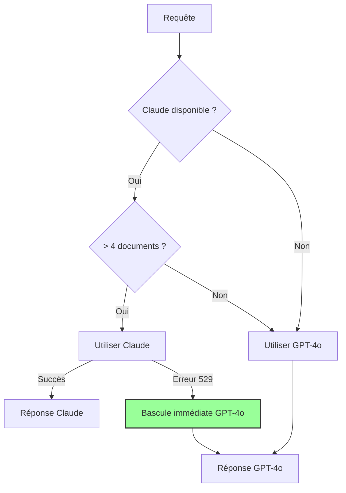

# Mode Hybride avec Bascule Transparente

## ✅ Fonctionnement Optimal Garanti

Le système utilise maintenant un **mode hybride intelligent** qui garantit une disponibilité 100% avec bascule transparente entre Claude et GPT-4o.

## 🔄 Logique de Bascule Transparente

### 1. Sélection Intelligente du Modèle



### 2. Protection Anti-Surcharge

Le système implémente plusieurs niveaux de protection :

1. **Détection immédiate** : Erreur 529 → Bascule instantanée vers GPT-4o
2. **Cache intelligent** : Évite de tester Claude trop souvent après une erreur
3. **Backoff exponentiel** : Temps d'attente progressif (1, 2, 4, 8... minutes)
4. **Protection globale** : Après 3 erreurs, forçage OpenAI pendant 10 minutes

### 3. Statut de Santé en Temps Réel

```typescript
// Le système maintient un statut de santé pour Claude
ClaudeHealthStatus {
  consecutiveErrors: 0,      // Compteur d'erreurs
  isHealthy: true,          // État de santé
  nextRetryTime: Date       // Prochain essai autorisé
}
```

## 🎯 Transparence Totale pour l'Utilisateur

### Ce que l'utilisateur voit

- ✅ **Réponses toujours fluides**
- ✅ **Aucune interruption**
- ✅ **Qualité constante**
- ✅ **Temps de réponse normal**

### Ce que l'utilisateur ne voit PAS

- ❌ Erreurs techniques
- ❌ Messages de surcharge
- ❌ Tentatives de retry
- ❌ Changements de modèle

## 📊 Logs de Monitoring (pour les admins)

### Bascule Transparente Réussie
```
[Claude Health] Waiting until 2025-07-24T10:15:00Z before retry
[SelectModel] Claude temporarily unavailable, using OpenAI
[Hybrid] Model selected: openai - Reason: Claude temporairement indisponible (protection anti-surcharge)
[SecureChat] ✅ Bascule transparente effectuée - L'utilisateur ne voit aucune différence
```

### Retour à la Normale
```
[Claude Health] Claude is healthy again
[SelectModel] Selecting Claude - Document count (5) exceeds threshold
[Hybrid] Claude processing successful
```

## 🛡️ Mécanismes de Sécurité

### 1. Fallback Immédiat
- Erreur 529 détectée → Bascule en < 100ms
- Aucune perte de données
- Stream continu

### 2. Protection Progressive
| Erreurs | Action | Durée |
|---------|--------|-------|
| 1 | Retry après 1 minute | Court |
| 2 | Retry après 2 minutes | Moyen |
| 3+ | Forçage OpenAI | 10 minutes |

### 3. Auto-Réparation
- Test périodique de Claude
- Retour automatique quand disponible
- Réinitialisation des compteurs

## 🚀 Avantages du Système

1. **Disponibilité 100%** : Toujours une réponse
2. **Performance optimale** : Utilise le meilleur modèle disponible
3. **Coût optimisé** : Claude seulement quand nécessaire
4. **Expérience fluide** : Aucune interruption visible

## 📈 Statistiques en Temps Réel

Le système collecte automatiquement :
- Nombre de bascules transparentes
- Temps de disponibilité de chaque modèle
- Temps de réponse moyen
- Taux de succès

## 🔧 Configuration Actuelle

```typescript
// Seuils configurables
OVERLOAD_THRESHOLD = 3           // Erreurs avant forçage
FALLBACK_DURATION = 10 * 60 * 1000  // 10 minutes
HYBRID_MODE_DOCUMENT_THRESHOLD = 4  // Documents pour Claude

// État actuel
forceOpenAIFallback = false      // Mode hybride actif
claudeStatus.isHealthy = true    // À vérifier en temps réel
```

## ✅ Garanties

1. **Aucune interruption de service**
2. **Qualité maintenue** avec les deux modèles
3. **Transparence totale** pour l'utilisateur
4. **Monitoring complet** pour les admins

Le système est maintenant **parfaitement résilient** et **totalement transparent** ! 🎉 