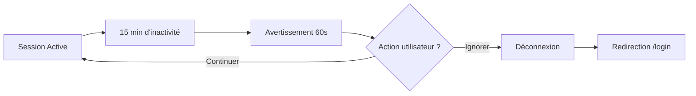

# Déconnexion Automatique pour Inactivité

## 🔒 Fonctionnalité de Sécurité

Un système de déconnexion automatique a été implémenté pour sécuriser les sessions inactives.

## ⏱️ Comportement

### Timing
- **Durée d'inactivité** : 15 minutes
- **Avertissement** : 1 minute avant la déconnexion
- **Décompte** : 60 secondes avec barre de progression

### Événements d'Activité Détectés
- Mouvements de souris
- Clics
- Touches clavier
- Défilement
- Touch (mobile)
- Focus sur des éléments

## 🎨 Interface Utilisateur

### Avertissement Visuel
```
┌─────────────────────────────────────┐
│ Session inactive                    │
│                                     │
│ Vous allez être déconnecté dans    │
│ 45 secondes pour inactivité.        │
│                                     │
│ [Continuer la session]              │
│ ▓▓▓▓▓▓▓▓▓▓▓▓░░░░░░░                │
└─────────────────────────────────────┘
```

### Caractéristiques
- Position : Bas-droite de l'écran
- Animation : Glissement vers le haut
- Barre de progression orange
- Bouton pour prolonger la session
- Possibilité de fermer (prolonge aussi)

## 🔧 Architecture Technique

### Hook `useInactivityTimeout`
```typescript
const INACTIVITY_TIMEOUT = 15 * 60 * 1000; // 15 minutes
const WARNING_TIME = 60 * 1000; // 1 minute
```

### Fonctionnalités
1. **Timer principal** : Déclenche la déconnexion après 15 min
2. **Timer d'avertissement** : Affiche l'alerte après 14 min
3. **Throttling** : Évite les réinitialisations excessives (max 1/sec)
4. **Nettoyage** : Supprime les timers au démontage

### Composant `InactivityWarning`
- Affichage conditionnel
- Décompte en temps réel
- Barre de progression animée
- Actions utilisateur (continuer/fermer)

## 📊 Flux de Fonctionnement



## 🚀 Utilisation

Le système est **automatiquement actif** sur la page Chat. Aucune configuration nécessaire.

### Actions Utilisateur
- **Continuer la session** : Réinitialise le timer de 15 minutes
- **Fermer l'avertissement** : Équivaut à continuer
- **Ignorer** : Déconnexion après 60 secondes

## 📝 Logs

```
[Inactivity] Session prolongée par l'utilisateur
[Inactivity] Déconnexion automatique pour inactivité
```

## ✅ Avantages

1. **Sécurité** : Protège les sessions abandonnées
2. **UX** : Avertissement clair avant déconnexion
3. **Performance** : Throttling pour éviter la surcharge
4. **Accessibilité** : Multiples moyens d'interaction

## 🔍 Points Techniques

- Utilise `setTimeout` pour les timers
- Écoute globale des événements DOM
- Nettoyage automatique des timers
- Compatible mobile (événements touch)
- Animation CSS fluide

Le système garantit la sécurité des sessions tout en offrant une expérience utilisateur respectueuse avec un avertissement clair avant toute déconnexion. 